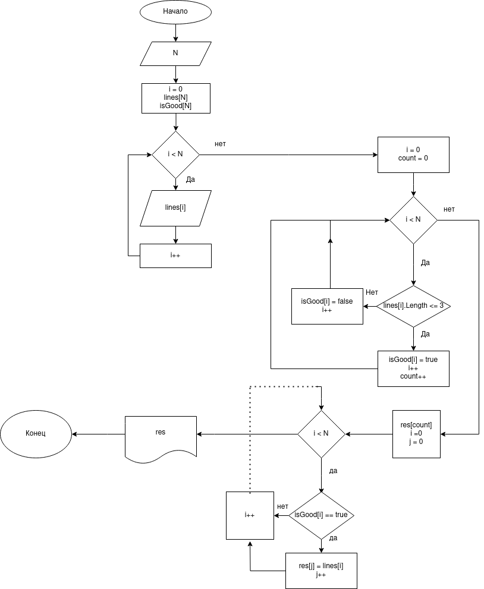

# Задание

Написать программу, которая из имеющегося массива строк формирует новый массив из строк, длина которых меньше, либо равна 3 символам. Первоначальный массив можно ввести с клавиатуры, либо задать на старте выполнения алгоритма. При решении не рекомендуется пользоваться коллекциями, лучше обойтись исключительно массивами.

__Примеры:__
```
[“Hello”, “2”, “world”, “:-)”] → [“2”, “:-)”]
[“1234”, “1567”, “-2”, “computer science”] → [“-2”]
[“Russia”, “Denmark”, “Kazan”] → []
```

# Этапы решения задачи

1. Ввести число слов

2. Считать слова

3. Определить количество слов, длина которых меньше либо равна 3 символам

4. Записать такие слова в результирующий массив

5. Вывести результат на экран

# Блок-схема работы алгоритма

